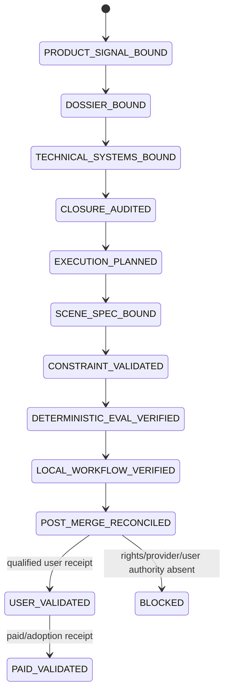
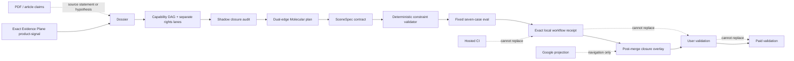

# AI Product Notes｜Market-to-MVP Opportunity Compiler

`AI Product Notes` is an evidence-aware Product Control Plane that converts product and market signals into license-gated capability maps, bounded MVP experiments, reverse-engineering dossiers, exact closure findings and reviewable implementation handoffs.

```text
market or source signal
→ freshness / identity / rights
→ atomic evidence and contradiction ledger
→ product dossier
→ technical capability DAG
→ problem-closure audit
→ dual-edge execution plan
→ molecular implementation atoms
→ exact technical/runtime receipts
→ user / paid / rights gates
→ roadmap admission or rejection
```

## Current decisions

### Market-to-MVP opportunity compiler

- **First external wedge:** Vendor API Blast-Radius CI.
- **Decision:** `VALIDATE`.
- **Opportunity score:** `62.06 / 100`.
- **Packet digest:** `sha256:45752a84a18efb5d25d8559fe4a9249a46448b0393c5db5c029d9e071e651364`.
- **Customer-origin evidence:** `ABSENT`.
- **Paid demand:** `ABSENT`.
- **Promotion law:** no qualified customer and paid-pilot receipts means no promotion to `BUILD`.

### Product Reverse-Engineering loop

- **Convergence merge:** [PR #67](https://github.com/ed3c/ai-product-notes/pull/67) → `8a63575492b07daf8e1f62432181e6dc2f2b6960`.
- **Current reconciled base:** `main@1d3365ba4eb708b827710be10740244deda95557` at Issue [#68](https://github.com/ed3c/ai-product-notes/issues/68) admission.
- **Decision ceiling:** `VALIDATE`.
- **Structured scene IR:** `LIVE_WORKFLOW_VERIFIED` for one bounded local SceneSpec workflow.
- **Deterministic constraint validation:** `LIVE_WORKFLOW_VERIFIED` for the same bounded local workflow.
- **Bidirectional canvas:** `NOT_IMPLEMENTED`.
- **Rendering / diffusion / provider lane:** `NOT_EXERCISED`.
- **User and paid evidence:** `ABSENT`.
- **Exact dependency rights:** `HUMAN_ADMIT_REQUIRED`.

Read the current closure overlay before using older generated packets:

- [`docs/traceability/PRODUCT_REVERSE_CLOSURE.md`](docs/traceability/PRODUCT_REVERSE_CLOSURE.md)
- [`docs/traceability/product-reverse-closure.json`](docs/traceability/product-reverse-closure.json)
- [`docs/traceability/local-handoff-execution-queue.json`](docs/traceability/local-handoff-execution-queue.json)

## Materialization snapshot

| Area | State | Exact evidence / boundary |
|---|---|---|
| Product datasets and daily intelligence | `MATERIALIZED` | `data/products/`, `notes/`, `reports/` |
| Commercial-rights asset ranking | `MATERIALIZED` | `RANK.md`; code/model/data/trajectory/service/content rights remain separate |
| Market, Agent, State Machine and Git governance | `MERGED` | PR #7, merge `bfe03383e96183d6b6eebd24462742090c733811` |
| Deterministic opportunity compiler | `MERGED / TESTED` | PR #8, merge `3fc46a25cc0089e092373b1a0c92a0780f91a5a2` |
| First Vendor API packet | `MERGED / VALIDATE` | PR #9, merge `fe7e03557f07b7c9ae91210d0405745b870dafcc` |
| Exact-head / synthetic-merge separation | `MERGED / HOSTED_VERIFIED` | PR #11, merge `0e2654f6a89c6110728950161d968b233c7e96b4` |
| Market-to-MVP final reconciliation | `MERGED / HOSTED_VERIFIED` | PR #13, merge `407f537018d59da52231f011ed52d69bfc0b6be2` |
| Product Reverse control binder | `MERGED / SUPERSEDED_BY_CURRENT_OVERLAY` | historical PR #53 payload integrated by PR #67 |
| Reverse-engineering dossier | `MERGED / VALIDATE` | legacy PR #54 head `736454e7ae49e351d146f3e9bb5c2ef67c846ecd`; payload integrated by PR #67 |
| Technical systems packet | `MERGED / DESIGN_ONLY` | legacy PR #55 head `72e89c89f1961db3735231a32efc5f4ac852d670`; payload integrated by PR #67 |
| Product closure audit | `MERGED / FINDINGS_ONLY` | legacy PR #57 head `34f77140968799c0c2669610609848beadf96646`; payload integrated by PR #67 |
| Dual-edge execution planner | `MERGED / PLANNING_ONLY` | legacy PR #59 head `2a37430337a87380afae6fc2617cd41692d9fd75`; payload integrated by PR #67 |
| SceneSpec contract | `MERGED / TECH_VERIFIED` | legacy PR #61 head `b0f59c7afad5b9acdbffbe9c87c1d86507237ea0`; payload integrated by PR #67 |
| Constraint validator | `MERGED / TECH_VERIFIED` | legacy PR #63 head `dd185109378a34109313b3a6fa150af9de0b76cf`; payload integrated by PR #67 |
| Deterministic seven-case eval | `MERGED / PASS` | legacy PR #65 head `f840f37582e925759bdf89290d7a5da1122d21d1`; payload integrated by PR #67 |
| Local structured-scene runtime | `MERGED / LIVE_WORKFLOW_VERIFIED` | local receipt commit `7225ca1b23d749f79ed1a98426dbcfd5302385be`; receipt blob `919303fce89e5247a34d0d0b03836eff358f2dd6` |
| Product Reverse convergence | `MERGED` | PR #67, merge `8a63575492b07daf8e1f62432181e6dc2f2b6960` |
| Exact Git Town executable admission | `ABSENT / BLOCKED_POLICY` | branch ancestry is not live Git Town execution |
| Google CodexDoc / Sheet projection registry | `PARTIAL / OPEN` | Issue #48; generic shared contracts still blocked by `skills-shared#443` |
| Three PDF-derived canaries | `PARTIAL` | one structured-product canary exists; Flair visual and separate AST-interaction canaries remain open under #49 |
| Buyer interviews / paid pilots | `ABSENT` | repository technical receipts are not customer or commercial evidence |

## Market-to-MVP State Machine and public/private boundary

The original opportunity compiler remains active and preserves these repository-owned states:

```text
DISCOVERED
→ FRESHNESS_VERIFIED
→ DEMAND_EVIDENCE_BOUND
→ STACK_DECOMPOSED
→ LICENSE_GATED
→ PORTFOLIO_MATCHED
→ GAP_CLASSIFIED
→ OPPORTUNITY_SCORED
→ MVP_PACKETED
→ EXPERIMENT_RUNNING
→ OUTCOME_VERIFIED
→ ADMITTED_TO_ROADMAP
```

Private capability input uses a **Git-ignored private overlay** and may emit only a sanitized capability envelope. **Private repository content is never an input to committed public artifacts.** Forbidden committed fields include **repo names / paths / URLs / code / raw traces / customer data / credentials**.

| Runtime / delivery lane | State | Boundary |
|---|---|---|
| Live `git town sync` | `NOT_EXERCISED` | GitHub ancestry is not an executable Git Town receipt |
| Exact Git Town executable admission | `ABSENT / BLOCKED_POLICY` | version/checksum/SBOM/host receipt absent |
| Customer validation | `ABSENT` | technical receipts are non-substitutable |
| Paid validation | `ABSENT` | no paid/adoption receipt |

## Repository topology

```text
ai-product-notes/
├── AGENTS.md
├── README.md
├── CONTEXT.md
├── RANK.md
├── reverse-engineering/
│   ├── README.md
│   └── runs/                              # control-binding and immutable run packets
├── docs/
│   ├── ARCHITECTURE.md
│   ├── STATE_MACHINES.md
│   ├── MARKET_SIGNAL_CONTRACT.md
│   ├── MVP_ROADMAP.md
│   ├── PORTFOLIO_INTEGRATION.md
│   ├── git/
│   │   ├── README.md
│   │   ├── REPO_PROFILE.md
│   │   ├── WORKER_PROTOCOL.md
│   │   ├── GIT_TOWN_ADMISSION.md
│   │   └── STACKED_PRS.md                 # historical delivery ledger
│   └── traceability/
│       ├── PRODUCT_REVERSE_CLOSURE.md      # current post-merge truth overlay
│       ├── product-reverse-closure.json
│       └── local-handoff-execution-queue.json
├── evals/
│   ├── reverse-engineering/                # dossier input/binding/output
│   ├── technical-systems/                  # capability DAG, rights and eval design
│   ├── problem-closure/                    # immutable Stage 6 captured audit
│   ├── execution-plan/                     # immutable Stage 7 plan and prompts
│   └── structured-scene/
│       ├── deterministic/                  # fixed positive/negative/mutation denominator
│       └── runtime/                        # exact local X02 contract/input/receipt/tests
├── schemas/
│   ├── reverse-engineering-*.schema.json
│   ├── technical-systems-*.schema.json
│   ├── problem-closure-instance.schema.json
│   ├── execution-plan-instance.schema.json
│   └── scene-spec.schema.json
├── src/ai_product_notes/
│   ├── reverse_engineering.py
│   ├── technical_systems.py
│   ├── problem_closure.py
│   ├── execution_planner.py
│   ├── scene_spec.py
│   └── constraint_validator.py
├── scripts/                                # deterministic compiler and canary entrypoints
├── tests/                                  # repository, compiler and planted-failure controls
├── opportunities/ experiments/ roadmap/   # Market-to-MVP outputs and gates
└── .github/workflows/                      # exact-head and synthetic-merge validation
```

## Directory-to-State-Machine ownership

| State | Owning paths | Input | Output / receipt | Fail-closed edge |
|---|---|---|---|---|
| `DISCOVERED` | `reports/`, `notes/`, `data/products/` | market/product candidate | normalized candidate | ambiguous or stale subject remains unadmitted |
| `DEMAND_EVIDENCE_BOUND` | `docs/MARKET_SIGNAL_CONTRACT.md`, signals | independent evidence groups | pain/recurrence/WTP state | launch/funding/pricing is not paid demand |
| `PRODUCT_SIGNAL_BOUND` | external Evidence Plane snapshot | atomic claims and contradictions | exact `product-signal@1` input | mutable URL or digest drift blocks |
| `DOSSIER_BOUND` | `evals/reverse-engineering/`, `reverse_engineering.py` | pinned product signal | user/problem/workflow/MVP hypothesis | no user or paid evidence caps `VALIDATE` |
| `TECHNICAL_SYSTEMS_BOUND` | `evals/technical-systems/`, `technical_systems.py` | dossier | capability DAG, rights/eval plan | design is not implementation or legal approval |
| `CLOSURE_AUDITED` | `evals/problem-closure/`, `problem_closure.py` | technical packet | captured matrix, audit, Issue deltas | generated findings do not repair code |
| `EXECUTION_PLANNED` | `evals/execution-plan/`, `execution_planner.py` | verified gaps | dual-edge DAG, leases, prompts, queue | start edge never satisfies completion |
| `SCENE_SPEC_BOUND` | `scene_spec.py`, schema, tests | deterministic MVP slice | canonical bytes and digest | unknown fields / duplicate keys / provider scope fail |
| `CONSTRAINT_VALIDATED` | `constraint_validator.py`, tests | SceneSpec | stable rule violations and digest-bound receipt | stale or unknown rules fail closed |
| `DETERMINISTIC_EVAL_VERIFIED` | `evals/structured-scene/deterministic/` | C/K bytes | fixed seven-case receipt | denominator cannot silently shrink |
| `LOCAL_WORKFLOW_VERIFIED` | `evals/structured-scene/runtime/` | exact local checkout | X02 local receipt | hosted CI cannot impersonate local runtime |
| `POST_MERGE_RECONCILED` | `docs/traceability/`, Issue #68 | current main + historical receipts | current closure and handoff overlay | captured historical packets are not rewritten |
| `USER_VALIDATED` | future qualified-user receipts | bounded workflow | user outcome | technical success cannot satisfy this lane |
| `PAID_VALIDATED` | future commercial receipts | admitted offer/pilot | payment/adoption evidence | no payment, no promotion |
| `RIGHTS_ADMITTED` | Human/legal owner | exact dependency set | separate rights decision | source license table is not transitive-rights proof |

## Product Reverse State Machine



## Product Reverse data flow and trust boundaries



## PDF-derived real-problem closure

The attached architecture source proposes the reusable pattern `DSL / structured AST + Constraint Solver + Bidirectional Canvas + deterministic rendering/validation`. Current repository closure is intentionally narrower:

| Source problem / mechanism | Current highest closure | Current evidence | Missing evidence |
|---|---|---|---|
| Structured DSL / AST | `LIVE_WORKFLOW_VERIFIED` | SceneSpec contract, deterministic tests, exact X02 local receipt | broader product/editor workload |
| Deterministic Constraint Solver | `LIVE_WORKFLOW_VERIFIED` | stable rule IDs, digest-bound receipts, local workflow | more rule families and product-specific quality gates |
| Bidirectional Canvas | `MECHANISM_BOUND / NOT_IMPLEMENTED` | dossier and technical design only | editor/canvas bytes, round-trip interaction receipt |
| Deterministic rendering farm | `MECHANISM_BOUND / NOT_IMPLEMENTED` | source/design hypothesis only | renderer implementation, exact runtime and quality oracle |
| Product floating / grounding | `MECHANISM_BOUND / NOT_IMPLEMENTED` | source proposes raycast/geometry grounding | exact 3D implementation and visual comparison receipt |
| Perspective mismatch | `MECHANISM_BOUND / NOT_IMPLEMENTED` | source proposes camera/depth conditioning | exact depth/camera implementation and evaluation |
| Lighting / contact-shadow discontinuity | `MECHANISM_BOUND / NOT_IMPLEMENTED` | source proposes mask/inpainting/contact shadow | exact implementation and visual-evidence receipt |
| Compute / latency / cost | `SOURCE_ANCHORED / NOT_EXERCISED` | source statements only | bounded benchmark on selected implementation |
| “100% permissive” dependency claim | `BLOCKED / HUMAN_ADMIT_REQUIRED` | source contains an LGPL/MIT qualification contradiction | exact selected artifacts, transitive license/SBOM review |
| Named company internal stacks | `SOURCE_ANCHORED / UNKNOWN` | source statements/hypotheses only | independent first-party or runtime evidence |
| User value | `ABSENT` | no qualified-user receipt | user study against declared workflow metrics |
| Paid demand | `ABSENT` | no paid/adoption receipt | paid pilot, preorder or equivalent commitment |

## Molecular Product Reverse Stack index

The following branches were true parent/child implementation subjects. They were **closed unmerged and superseded as publication vehicles** when convergence PR #67 merged their combined payload. Do not describe them as individually merged.

```text
main@d3883498538576a5ab928956ef2a048172242eaf
├── historical sibling PR #53  C00 control binding
│   head 0f492491048d0c18a57ea0049fa167ef912652a5
│
└── PR #54  K01 dossier
    head 736454e7ae49e351d146f3e9bb5c2ef67c846ecd
    └── PR #55  K01B technical systems
        head 72e89c89f1961db3735231a32efc5f4ac852d670
        └── PR #57  E01 problem closure
            head 34f77140968799c0c2669610609848beadf96646
            └── PR #59  K02 dual-edge planner
                head 2a37430337a87380afae6fc2617cd41692d9fd75
                └── PR #61  C02 SceneSpec
                    head b0f59c7afad5b9acdbffbe9c87c1d86507237ea0
                    └── PR #63  K03 validator
                        head dd185109378a34109313b3a6fa150af9de0b76cf
                        └── PR #65  E02 deterministic eval
                            head f840f37582e925759bdf89290d7a5da1122d21d1
                            └── local X02 receipt
                                commit 7225ca1b23d749f79ed1a98426dbcfd5302385be
```

Publication convergence:

```text
PR #67 agent/50-open-pr-convergence
head  fbad39abb42818c7362f58bb0751378b3bd4cdd2
merge 8a63575492b07daf8e1f62432181e6dc2f2b6960
scope combined PR #53 + linear #54→#65 + X02 + D02 + workflow repair
```

The current main overlay is owned by Issue #68. Historical Stage 6 and Stage 7 generated artifacts remain immutable captured-state evidence; current truth is in `docs/traceability/`.

## Evidence lanes

```text
source statement != observed company truth
fresh launch != buyer pain
competitor pricing != payment for this product
permissive code license != model/data/trajectory/service/content rights
architecture/design packet != implementation
compiler or CI PASS != local runtime
local runtime != user validation
user validation != paid validation
Google Doc/Sheet projection != Git completion authority
GitHub branch graph != live Git Town execution
merged implementation != market validation or revenue
```

## Delivery lanes

### `DATA_INCREMENT_LANE`

Only already-admitted automation may increment dated reports, notes, product shards and evidence-backed rankings. It must remain bounded and subject-aware.

### `PRODUCT_CHANGE_LANE`

`AGENTS.md`, shared README/indexes, architecture, schemas, compiler/runtime code, tests, workflows, closure overlays and roadmap semantics require Issue-first branches, explicit path leases, checks and Human/trusted admission.

## Historical Market-to-MVP Stack

```text
main
├── PR #7  merge bfe03383e96183d6b6eebd24462742090c733811
├── PR #8  merge 3fc46a25cc0089e092373b1a0c92a0780f91a5a2
├── PR #9  merge fe7e03557f07b7c9ae91210d0405745b870dafcc
├── PR #11 merge 0e2654f6a89c6110728950161d968b233c7e96b4
└── PR #13 merge 407f537018d59da52231f011ed52d69bfc0b6be2
```

See [`docs/git/STACKED_PRS.md`](docs/git/STACKED_PRS.md) for the historical control-plane ledger. That ledger may contain captured pre-convergence wording; use the current overlay above for Product Reverse status.

## Validation

```bash
python3 scripts/check_repository_contract.py
python3 -m unittest discover -s tests -p 'test_*.py'

python3 scripts/compile_reverse_engineering_dossier.py --check
python3 scripts/compile_technical_systems_packet.py --check
python3 scripts/compile_problem_closure.py --check
python3 scripts/compile_execution_plan.py --check
python3 scripts/run_structured_scene_canary.py --check
```

Commands that need arguments or exact paths must use the owning README/AGENTS and persisted packet. Do not infer them from this summary.

## Current roadmap gates

1. complete `skills-shared#443` through a provenance-compliant local machine-author commit;
2. complete GitHub-canonical CodexDoc and bounded Sheet projection under #48 / `ai-content-notes#41`;
3. execute the remaining Flair visual and separate AST-interaction canaries under #49;
4. bind exact rendering/provider dependencies and complete separate rights review;
5. obtain qualified-user workflow evidence;
6. obtain paid/adoption evidence;
7. converge documentation and close Epic #44 only when all required lanes are completed, rejected, blocked with owner, or superseded.
