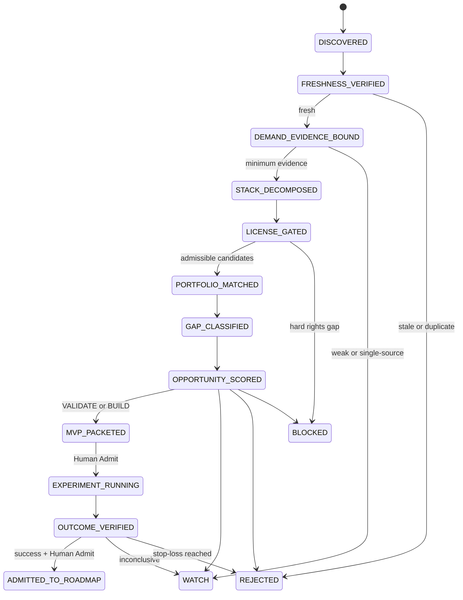
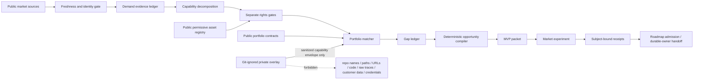

# AI Product Notes｜Market-to-MVP Opportunity Compiler

AI Product Notes is an evidence-aware control plane that turns fresh product signals into **license-gated stack maps, portfolio gaps, bounded MVP experiments and reviewable implementation handoffs**.

The repository keeps the existing Top-100 product datasets and bilingual research notes, but its development direction is no longer “collect more products.” The target loop is:

```text
market signal
→ demand evidence
→ capability decomposition
→ commercially usable asset gate
→ public/private portfolio match
→ gap classification
→ deterministic opportunity score
→ bounded MVP packet
→ experiment receipts
→ roadmap admission or rejection
```

## Current decision

- **Repository product:** Market-to-MVP Opportunity Compiler — materialize the decision contract before building more dashboards.
- **First external market wedge:** Vendor API Blast-Radius CI — validate whether API-heavy teams will pay to map a provider change to the exact call-sites they use.
- **Second strategic wedge:** Agent/Harness compatibility and governance — pursue only after the first compiler and evidence loop are stable.
- **Current market state:** research-backed hypothesis; no paid-pilot receipt exists in this repository.

## Current integration snapshot

| Area | State | Evidence / non-claim |
|---|---|---|
| Top-100 product datasets and daily research | `MATERIALIZED` | `data/products/`, `notes/`, `reports/daily/` |
| Commercially usable asset ranking | `MATERIALIZED` | `RANK.md`; code/model/data/trajectory rights remain separate |
| Market Signal and MVP contracts | `MATERIALIZED` on planned Leaf 01 | documentation proves contract only |
| Deterministic opportunity compiler | `PLANNED` on Leaf 02 | no executable claim from this branch |
| First Vendor API opportunity packet | `PLANNED` on Leaf 03 | no customer validation claim |
| Public/private portfolio bridge | `DOCUMENTED` | private implementation details must stay outside Git |
| Git Town shared Skill binding | `DOCUMENTED` | canonical method remains in `skills-shared` |
| Exact Git Town executable admission | `ABSENT / BLOCKED_POLICY` | no version/checksum/SBOM admission |
| Live `git town sync` | `NOT_EXERCISED` | branch documentation is not a sync receipt |
| Hosted CI for this stack | `NOT_EXERCISED` until a run exists | local/connector evidence cannot proxy GitHub Actions |
| Merge/ship/roadmap promotion | `HUMAN_ADMIT` | Draft PR publication is not merge or market admission |

## Repository topology

```text
ai-product-notes/
├── AGENTS.md                         # cross-host Agent routing and safety laws
├── README.md                         # current state, topology, data flow and Stack index
├── CONTEXT.md                        # product-language → implementation questions
├── RANK.md                           # commercially usable asset evidence and ranking
├── docs/
│   ├── ARCHITECTURE.md               # ownership and trust boundaries
│   ├── STATE_MACHINES.md             # state transitions and failure edges
│   ├── MARKET_SIGNAL_CONTRACT.md     # evidence, demand and substitution gates
│   ├── MVP_ROADMAP.md                # stage gates and experiment admission
│   ├── CONFIG.md                     # fixed operational policy
│   ├── DAILY_MONITOR_PROMPT.md       # daily signal-to-opportunity procedure
│   ├── DATA_MODEL.md                 # existing Top-100 dataset contract
│   └── git/                          # repository-owned Git Town-compatible profile
├── data/
│   ├── products/                     # sharded ranked product datasets
│   └── assets/                       # versioned asset/right registry
├── notes/ and reports/               # source-bound product intelligence
├── config/                           # public portfolio + ignored private overlay example
├── schemas/                          # machine contracts
├── src/ai_product_notes/             # deterministic compiler
├── scripts/                          # contract and compiler entrypoints
├── examples/                         # admitted public fixtures
├── opportunities/                    # generated opportunity packets
├── experiments/                      # market-test contracts and receipts, not claims
├── roadmap/                          # admitted opportunity states
├── tests/                            # positive and planted negative controls
└── .github/workflows/                # subject-bound hosted validation
```

## Directory-to-State-Machine ownership

| State / lane | Owning paths | Input | Output / receipt | Fail-closed boundary |
|---|---|---|---|---|
| `DISCOVERED` | `reports/daily/`, `notes/`, `data/products/` | candidate launch, funding, pricing or pain signal | normalized candidate identity | stale, duplicate or date-ambiguous signals are excluded |
| `FRESHNESS_VERIFIED` | `docs/DAILY_MONITOR_PROMPT.md`, signal fixture | source/event timestamps | freshness result | search re-indexing is not a new event |
| `DEMAND_EVIDENCE_BOUND` | `docs/MARKET_SIGNAL_CONTRACT.md`, `examples/signals/` | independent evidence groups | buyer/pain/WTP evidence summary | launch noise cannot become paid demand |
| `STACK_DECOMPOSED` | `CONTEXT.md`, compiler | product workflow | required capability graph | feature similarity cannot proxy implementation mapping |
| `LICENSE_GATED` | `RANK.md`, `data/assets/` | code/model/data/trajectory/service candidates | per-asset right state | only direct `PASS` counts toward coverage |
| `PORTFOLIO_MATCHED` | `config/`, `docs/PORTFOLIO_INTEGRATION.md` | required capabilities | public matches + sanitized private envelopes | private names, code, paths, URLs and raw traces are forbidden |
| `GAP_CLASSIFIED` | compiler | demand + stack + portfolio state | market/evidence/stack/portfolio/delivery gap ledger | unknowns remain explicit |
| `OPPORTUNITY_SCORED` | `src/ai_product_notes/` | validated versioned inputs | deterministic score and decision | hard privacy/right gaps cannot be compensated by score |
| `MVP_PACKETED` | `opportunities/` | admitted `VALIDATE` candidate | hypothesis, wedge, metrics, budget and stop-loss | packet is not an executed pilot |
| `EXPERIMENT_RUNNING` | `experiments/` | approved MVP packet | interview/replay/pilot receipts | anecdotes without subject/time/actor are not receipts |
| `OUTCOME_VERIFIED` | experiment evaluator / owning repo | exact receipts | pass/fail/inconclusive result | self-authored success is insufficient |
| `ADMITTED_TO_ROADMAP` | `roadmap/` | verified outcome + Human Admit | durable-owner handoff | no receipt, no promotion |
| `WATCH` / `REJECTED` / `BLOCKED` | opportunity + roadmap ledgers | weak, stale or unsafe candidate | reason and revisit condition | never silently upgraded |

## State machine



## Actual data flow and trust boundaries



### Public/private boundary

A public portfolio entry may identify a public repository and public evidence. A private provider is represented only by a Git-ignored local overlay and may export a sanitized capability envelope. **Private repository content is never an input to committed public artifacts.**

## Evidence lanes

```text
source discovered != source fresh
fresh launch != buyer pain
competitor price != payment for our product
permissive code license != model/data/trajectory/service rights
portfolio match != technical equivalence
compiler PASS != market validation
MVP packet != executed experiment
local test != hosted CI
branch graph != live Git Town sync
Draft PR != merge/ship/Human Admit
```

## Delivery lanes

### `DATA_INCREMENT_LANE`

Allowed only for an already-admitted automation whose write scope is limited to dated reports, notes, product shards and evidence-backed ranking updates. It must be incremental, read-before-write and subject-bound. Interactive agents do not use this lane to bypass review.

### `PRODUCT_CHANGE_LANE`

Required for `AGENTS.md`, README/shared indexes, architecture, policies, schemas, compiler/runtime code, tests, workflows and roadmap semantics. Use Issue-first molecular branches, disjoint path leases and bottom-up Draft PR review.

## Planned molecular Stack PR graph

```text
main@ab9596ff1df2b44785e28baad650f93f21b9786c
└── agent/4-market-control-plane        Issue #4 / Draft PR TBD
    └── agent/5-opportunity-compiler    Issue #5 / Draft PR TBD
        └── agent/6-portfolio-convergence Issue #6 / Draft PR TBD
```

The graph is Git Town-compatible, but exact Git Town admission and live synchronization remain `ABSENT / NOT_EXERCISED`. See `docs/git/STACKED_PRS.md`.

## Validation

```bash
python3 scripts/check_repository_contract.py
python3 -m unittest discover -s tests -p 'test_*.py'

python3 scripts/compile_opportunity.py \
  examples/signals/vendor-api-blast-radius.json \
  --assets data/assets/registry.json \
  --public-portfolio config/public-portfolio.json \
  --output /tmp/vendor-api-opportunity.json
```

## Roadmap order

1. Bind governance and Agent routing.
2. Ship the deterministic opportunity compiler and negative controls.
3. Commit the first reproducible `VALIDATE` packet.
4. Run buyer interviews and historical change replay.
5. Promote a durable product implementation only after market receipts pass the stop-loss contract.
6. Add recurring roadmap refresh from new signals without silently rewriting historical evidence.
