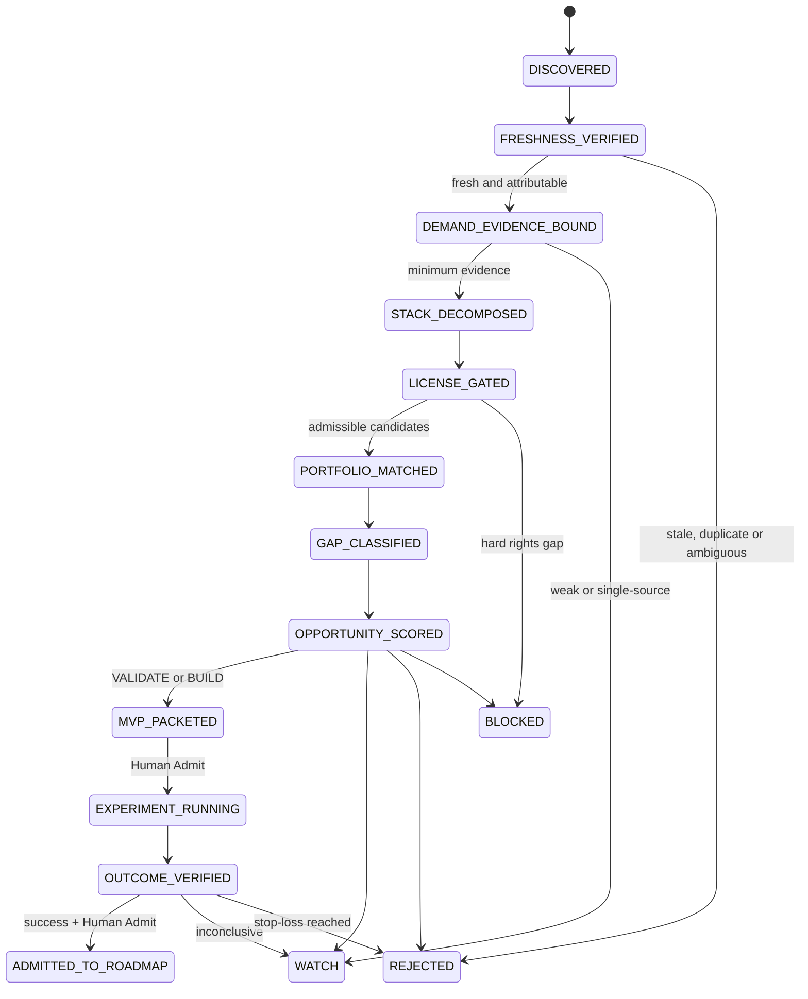
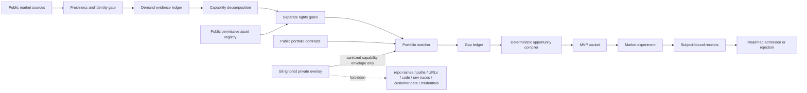

# AI Product Notes｜Market-to-MVP Opportunity Compiler

`AI Product Notes` is an evidence-aware control plane that converts current product and market signals into **license-gated capability maps, portfolio gaps, bounded MVP experiments, and reviewable implementation handoffs**.

`AI Product Notes` 是一個 evidence-first 的市場到 MVP 控制平面，把產品訊號轉成可驗證需求、可商用技術替代、現有資產缺口、MVP 實驗與可追溯交付。

```text
market signal
→ freshness and identity
→ demand evidence
→ capability decomposition
→ commercial-rights gate
→ public/private portfolio match
→ gap classification
→ deterministic opportunity decision
→ bounded MVP packet
→ experiment receipts
→ roadmap admission or rejection
```

## Current decision / 目前決策

- **Repository product:** Market-to-MVP Opportunity Compiler.
- **First external wedge:** Vendor API Blast-Radius CI — map a provider/API change to the exact repository call sites exposed to it.
- **Decision:** `VALIDATE`.
- **Opportunity score:** `62.06 / 100`.
- **Packet digest:** `sha256:45752a84a18efb5d25d8559fe4a9249a46448b0393c5db5c029d9e071e651364`.
- **Paid demand:** `ABSENT`.
- **Customer-origin evidence:** `ABSENT`.
- **Missing proprietary differentiator:** `callsite-impact-join`.
- **Promotion rule:** no customer and paid-pilot receipts means no promotion to `BUILD`.

## Materialization snapshot / 整合現況

| Area | State | Exact evidence / boundary |
|---|---|---|
| Product datasets and daily intelligence | `MATERIALIZED` | `data/products/`, `notes/`, `reports/` |
| Commercially usable asset ranking | `MATERIALIZED` | `RANK.md`; code, model, data, trajectory, hosted-service and third-party-content rights are separate |
| Market, Agent, State Machine and Git governance | `MERGED` | [PR #7](https://github.com/ed3c/ai-product-notes/pull/7), merge `bfe03383e96183d6b6eebd24462742090c733811` |
| Deterministic opportunity compiler | `MERGED / TESTED` | [PR #8](https://github.com/ed3c/ai-product-notes/pull/8), merge `3fc46a25cc0089e092373b1a0c92a0780f91a5a2` |
| First Vendor API opportunity packet | `MERGED / VALIDATE` | [PR #9](https://github.com/ed3c/ai-product-notes/pull/9), merge `fe7e03557f07b7c9ae91210d0405745b870dafcc` |
| Exact-head and synthetic-merge CI separation | `MERGED / HOSTED_VERIFIED` | [PR #11](https://github.com/ed3c/ai-product-notes/pull/11), merge `0e2654f6a89c6110728950161d968b233c7e96b4`, run `31881831160` |
| Final README and Stack reconciliation | `MERGED / HOSTED_VERIFIED` | [PR #13](https://github.com/ed3c/ai-product-notes/pull/13), merge `407f537018d59da52231f011ed52d69bfc0b6be2`, PR run `31882048251`, exact-main run `31882091779` |
| Terminal receipt pointer | `RECEIPT_ONLY` | [Issue #14](https://github.com/ed3c/ai-product-notes/issues/14) → [PR #15](https://github.com/ed3c/ai-product-notes/pull/15); final housekeeping result is authoritative in GitHub metadata |
| Public/private portfolio bridge | `MATERIALIZED` | public contracts plus sanitized private capability envelopes only |
| Historical Git Town-compatible Stack PR graph | `MERGED / AUDITABLE` | original branches, bases, stage heads and merge commits are indexed below |
| Exact Git Town executable admission | `ABSENT / BLOCKED_POLICY` | no exact version, executable checksum, SBOM and host admission receipt |
| Live `git town sync` | `NOT_EXERCISED` | GitHub branch ancestry is not a Git Town runtime receipt |
| Buyer interviews, replay and paid pilot | `NOT_EXERCISED` | experiment contracts exist; no outcome is claimed |
| Market validation / revenue | `ABSENT` | compiler output and merged code are not market evidence |

## Repository topology / 目錄結構

```text
ai-product-notes/
├── AGENTS.md                         # cross-host Agent routing and fail-closed laws
├── README.md                         # current state, data flow, State Machines and delivery index
├── CONTEXT.md                        # product language → implementation questions
├── RANK.md                           # commercially usable asset evidence and ranking
├── docs/
│   ├── ARCHITECTURE.md               # ownership and trust boundaries
│   ├── STATE_MACHINES.md             # state transitions and failure edges
│   ├── MARKET_SIGNAL_CONTRACT.md     # freshness, demand and substitution gates
│   ├── MVP_ROADMAP.md                # experiment and promotion gates
│   ├── PORTFOLIO_INTEGRATION.md      # public/private capability handoff
│   ├── CONFIG.md                     # operational and delivery policy
│   ├── DAILY_MONITOR_PROMPT.md       # recurring market-signal procedure
│   ├── DATA_MODEL.md                 # Top-100 dataset contract
│   └── git/
│       ├── README.md                 # Git governance status
│       ├── REPO_PROFILE.md           # repository-owned Git Town profile
│       ├── WORKER_PROTOCOL.md        # Worker, lease and receipt contract
│       ├── GIT_TOWN_ADMISSION.md     # executable/config admission state
│       └── STACKED_PRS.md            # branches, PRs, SHAs and hosted receipts
├── data/
│   ├── products/                     # sharded product datasets
│   └── assets/registry.json          # versioned assets and separate rights states
├── config/
│   ├── public-portfolio.json         # public capability contracts
│   └── private-portfolio.example.json# sanitized local-overlay schema example
├── schemas/                          # versioned input/output contracts
├── src/ai_product_notes/             # deterministic compiler
├── scripts/                          # repository contract and compiler entrypoints
├── examples/                         # admitted public and negative-control fixtures
├── opportunities/                    # reproducible opportunity packets
├── experiments/                      # interview/replay/pilot contracts and receipt schema
├── roadmap/                          # admitted decision states
├── tests/                            # positive tests and planted negative controls
└── .github/workflows/                # exact-subject hosted validation
```

## Directory-to-State-Machine ownership

| State | Owning paths | Input | Output / receipt | Fail-closed edge |
|---|---|---|---|---|
| `DISCOVERED` | `reports/`, `notes/`, `data/products/` | launch, funding, pricing or pain candidate | normalized candidate identity | missing identity stays unadmitted |
| `FRESHNESS_VERIFIED` | `docs/DAILY_MONITOR_PROMPT.md`, signal fixtures | event and source dates | freshness decision | stale, re-indexed or ambiguous sources are excluded |
| `DEMAND_EVIDENCE_BOUND` | `docs/MARKET_SIGNAL_CONTRACT.md`, `examples/signals/` | independent evidence groups | pain, recurrence and WTP state | launch presence and competitor pricing are not paid demand |
| `STACK_DECOMPOSED` | `CONTEXT.md`, compiler | product workflow | required capability graph | feature similarity cannot proxy implementation equivalence |
| `LICENSE_GATED` | `RANK.md`, `data/assets/` | code/model/data/trajectory/service candidates | per-asset rights state | only direct `PASS` rights count toward substitution coverage |
| `PORTFOLIO_MATCHED` | `config/`, `docs/PORTFOLIO_INTEGRATION.md` | required capabilities | public matches and sanitized private envelopes | forbidden private metadata blocks output |
| `GAP_CLASSIFIED` | compiler | demand, stack and portfolio state | market/evidence/stack/portfolio/delivery gaps | unknowns remain explicit |
| `OPPORTUNITY_SCORED` | `src/ai_product_notes/` | canonical versioned inputs | deterministic score and decision | hard privacy/rights failures cannot be offset by score |
| `MVP_PACKETED` | `opportunities/` | admitted `VALIDATE` candidate | wedge, metrics, price test and stop-loss | packet is not an executed pilot |
| `EXPERIMENT_RUNNING` | `experiments/` | Human-admitted MVP | interview/replay/pilot receipts | unbound anecdotes are not receipts |
| `OUTCOME_VERIFIED` | experiment evaluator and durable owner | exact receipts | pass/fail/inconclusive result | self-authored success is insufficient |
| `ADMITTED_TO_ROADMAP` | `roadmap/` | verified outcome plus Human Admit | durable-owner implementation handoff | no receipt, no promotion |
| `WATCH` / `REJECTED` / `BLOCKED` | opportunity and roadmap ledgers | weak, stale, unsafe or incomplete candidate | reason and revisit condition | never silently upgraded |

## State Machine



## Data flow and trust boundaries



### Public/private boundary

A public portfolio entry may identify public repositories and public evidence. Private capabilities enter through a **Git-ignored private overlay** and may export only a versioned, sanitized capability envelope.

**Private repository content is never an input to committed public artifacts.**

Forbidden public fields include **repo names / paths / URLs / code / raw traces / customer data / credentials**. A capability envelope may expose only provider-neutral capability IDs, contract versions, evidence labels, receipt digests, exportability and limitations.

## Evidence lanes

```text
source discovered != source fresh
fresh launch != buyer pain
competitor pricing != payment for this product
permissive code license != model/data/trajectory/service rights
portfolio match != technical equivalence
compiler PASS != market validation
MVP packet != executed experiment
local test != hosted CI
exact-head CI != synthetic-merge CI
GitHub branch graph != live Git Town sync
merged implementation != customer adoption or revenue
```

## Opportunity compiler contract

```text
versioned market signal
+ versioned asset/right registry
+ public portfolio registry
+ optional Git-ignored private capability overlay
→ evidence and demand gates
→ required capability graph
→ admissible substitutions
→ portfolio matches and uncovered capabilities
→ gap ledger
→ deterministic score and decision
→ canonical SHA-256 digest
```

Hard rules:

- Only direct `PASS` rights count toward substitution coverage.
- `UNKNOWN`, `CONDITIONAL` and `REJECT` remain visible but cannot silently improve coverage.
- Missing direct paid demand caps the decision at `VALIDATE`.
- Privacy or rights violations produce `BLOCKED`, regardless of score.
- Identical canonical inputs produce byte-stable output.

## First MVP wedge: Vendor API Blast-Radius CI

```text
one TypeScript repository
+ one AI-model API family
+ two pinned provider snapshots
→ extract source call sites
→ normalize provider/API changes
→ join changes to actual usage
→ emit evidence-linked GitHub Check
```

Explicit non-goals:

- automatic code repair;
- universal language or vendor coverage;
- universal API knowledge graph;
- production write permissions;
- a large dashboard before paid evidence.

Validation targets:

```text
10 qualified buyer interviews
≥ 3 strong pain confirmations
≥ 5 relevant historical breakages
false-positive rate < 10%
first impact report < 5 minutes
≥ 2 paid pilots or equivalent binding commitments
```

Stop-loss:

```text
< 3 strong confirmations after 10 interviews
or false-positive rate ≥ 20% after two repair rounds
or < 3 relevant historical changes
or no legal/stable provider evidence source
or buyers only want a free changelog summary
→ remain WATCH or REJECT; do not build a platform
```

## Delivery lanes

### `DATA_INCREMENT_LANE`

Only an already-admitted automation may increment dated reports, notes, product shards and evidence-backed rankings. It must be read-before-write, bounded and subject-aware. Interactive Agents do not use this lane to bypass review.

### `PRODUCT_CHANGE_LANE`

`AGENTS.md`, shared README/indexes, architecture, policies, schemas, compiler/runtime code, tests, workflows and roadmap semantics require Issue-first branches, explicit path leases, checks, reviewable PRs and Human Admit.

## Complete Stack PR index

The original Git Town-compatible graph was published as Draft PRs and retained as historical evidence:

```text
main@ab9596ff1df2b44785e28baad650f93f21b9786c
└── agent/4-market-control-plane@8ae076852bce7f1abe3344b8db0d6b2df42c61eb
    Issue #4 · DRAFT_PUBLISHED PR #7 · base main
    └── agent/5-opportunity-compiler@849b50a011abdbe9940fa52d597a456902601e64
        Issue #5 · DRAFT_PUBLISHED PR #8 · base agent/4-market-control-plane
        └── agent/6-portfolio-convergence@83243ba32729a75e953125370a8cb0b61cee197f
            stage head 6d88ed1fc26c74d8e5ad0d0e0fdef09e38560d81
            Issue #6 · DRAFT_PUBLISHED PR #9 · base agent/5-opportunity-compiler
            └── agent/10-exact-head-ci@e37bf18dd39f91f207753d6aaad546125b62a6f1
                Issue #10 · DRAFT_PUBLISHED PR #11 · original base agent/6-portfolio-convergence
```

Human Admit was applied bottom-up with merge commits:

| Order | Issue / PR | Scope | Merge / receipt |
|---:|---|---|---|
| 1 | [#4](https://github.com/ed3c/ai-product-notes/issues/4) / [#7](https://github.com/ed3c/ai-product-notes/pull/7) | governance, Agent routing, State Machines, data flow, Git profile | `bfe03383e96183d6b6eebd24462742090c733811` |
| 2 | [#5](https://github.com/ed3c/ai-product-notes/issues/5) / [#8](https://github.com/ed3c/ai-product-notes/pull/8) | compiler, schemas, asset rights, portfolio envelopes, tests | `3fc46a25cc0089e092373b1a0c92a0780f91a5a2` |
| 3 | [#6](https://github.com/ed3c/ai-product-notes/issues/6) / [#9](https://github.com/ed3c/ai-product-notes/pull/9) | opportunity, MVP, experiments, portfolio handoff, roadmap | `fe7e03557f07b7c9ae91210d0405745b870dafcc` |
| 4 | [#10](https://github.com/ed3c/ai-product-notes/issues/10) / [#11](https://github.com/ed3c/ai-product-notes/pull/11) | exact-head versus synthetic-merge CI evidence | `0e2654f6a89c6110728950161d968b233c7e96b4` |
| 5 | [#12](https://github.com/ed3c/ai-product-notes/issues/12) / [#13](https://github.com/ed3c/ai-product-notes/pull/13) | final merged-state README and Stack reconciliation | `407f537018d59da52231f011ed52d69bfc0b6be2` |
| receipt | [#14](https://github.com/ed3c/ai-product-notes/issues/14) / [#15](https://github.com/ed3c/ai-product-notes/pull/15) | replace stale pre-merge wording; no product behavior change | final result authoritative in GitHub metadata and completion comment |

See [`docs/git/STACKED_PRS.md`](docs/git/STACKED_PRS.md) for exact bases, stage heads, subjects and run IDs.

## Hosted CI receipts

### Stage and implementation history

```text
run 31878162441
  exact-head: 5b646ec6fe70dd2047734636b8dfd517ee2998b2
  synthetic-merge: 3bb417881393b5faad2a91056c49c77eefeb3cc8
  base: 83243ba32729a75e953125370a8cb0b61cee197f
  result: HOSTED_VERIFIED · 23 tests in both lanes

run 31878346277
  exact-head: ac66cc60963b77c5f5872d0825c40319c2bfa855
  synthetic-merge: c2336332cc279142194beaae39a04b248f45b7ed
  result: HOSTED_VERIFIED · 24 tests in both lanes

run 31881831160
  exact-head: e37bf18dd39f91f207753d6aaad546125b62a6f1
  synthetic-merge: 3fad2f88232fc489bc1cf0af4a68d2779944451b
  base: fe7e03557f07b7c9ae91210d0405745b870dafcc
  result: HOSTED_VERIFIED · 24 tests in both lanes
```

### Final reconciliation and exact-main proof

```text
PR #13 run 31882048251
  exact-head: 2b7f2db9d832f894adace6772e63e0db824bab39
  synthetic-merge: 18701b2644effb6c49d050b83edf6fa593c91e9f
  base: 0e2654f6a89c6110728950161d968b233c7e96b4
  result: HOSTED_VERIFIED · repository contract PASS · 24 tests in both lanes

push run 31882091779
  exact-main: 407f537018d59da52231f011ed52d69bfc0b6be2
  result: repository contract PASS · 24 tests PASS · packet reproduction PASS
  synthetic-merge: SKIPPED_BY_EVENT_POLICY on push
```

The receipt-only PR #15 must pass its own exact-head and synthetic-merge lanes; its GitHub metadata and Issue #14 completion comment are the authoritative final receipt.

## Validation

```bash
python3 scripts/check_repository_contract.py
python3 -m unittest discover -s tests -p 'test_*.py'

python3 scripts/compile_opportunity.py \
  examples/signals/vendor-api-blast-radius.json \
  --assets data/assets/registry.json \
  --public-portfolio config/public-portfolio.json \
  --output /tmp/vendor-api-opportunity.json

python3 scripts/compile_opportunity.py --check /tmp/vendor-api-opportunity.json
python3 scripts/compile_opportunity.py --check opportunities/vendor-api-blast-radius/opportunity.json
```

## Next roadmap gate

The control plane is materialized. The next product work is evidence generation rather than platform expansion:

1. run the interview contract against qualified API-heavy B2B teams;
2. build a bounded historical replay corpus;
3. implement and independently test the `callsite-impact-join` thin slice in the selected durable owner;
4. emit a read-only GitHub Check;
5. request paid-pilot commitment;
6. promote from `VALIDATE` only after receipt thresholds and Human Admit pass.
