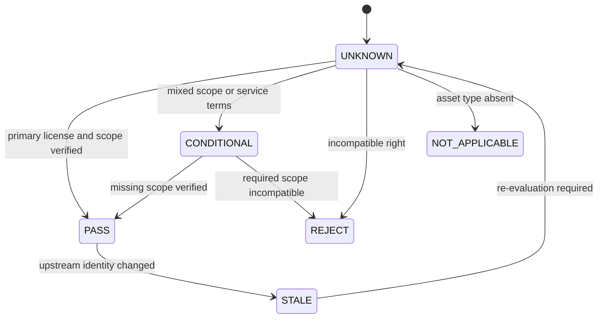

# State Machines｜狀態機契約

## Opportunity lifecycle

| State | Entry requirement | Owner | Required output | Failure edge |
|---|---|---|---|---|
| `DISCOVERED` | candidate identity and source pointer | daily monitor | candidate record | `REJECTED` for duplicate/identity collision |
| `FRESHNESS_VERIFIED` | event and source dates inside policy | freshness gate | freshness receipt | `REJECTED` for stale/re-indexed event |
| `DEMAND_EVIDENCE_BOUND` | independent evidence groups classified | signal contract | evidence ledger | `WATCH` for weak/single-source evidence |
| `STACK_DECOMPOSED` | user workflow and capabilities explicit | decision plane | capability requirements | `BLOCKED` if workflow is illegible |
| `LICENSE_GATED` | each asset type checked separately | asset registry | right-state matrix | `BLOCKED` on hard required right failure |
| `PORTFOLIO_MATCHED` | public registry + sanitized overlay | portfolio matcher | candidate matches | `BLOCKED` on private-data leak |
| `GAP_CLASSIFIED` | demand/stack/portfolio results | compiler | gap ledger | no silent omission |
| `OPPORTUNITY_SCORED` | versioned validated inputs | compiler | score + decision | `BLOCKED` on hard gate |
| `MVP_PACKETED` | decision `VALIDATE` or `BUILD` | roadmap compiler | bounded experiment | no execution claim |
| `EXPERIMENT_RUNNING` | Human Admit + subject/budget | experiment owner | receipts | stop-loss or `BLOCKED` |
| `OUTCOME_VERIFIED` | independent receipt review | evaluator | pass/fail/inconclusive | failed evidence remains failed |
| `ADMITTED_TO_ROADMAP` | success + Human Admit | roadmap owner | durable handoff | no automatic promotion |

## Decision state rules

```text
BLOCKED
  hard privacy/right/schema/freshness failure

REJECT
  low score or stop-loss reached

WATCH
  weak evidence, weak timing or unresolved demand

VALIDATE
  worthwhile hypothesis; paid demand or full stack evidence still absent

BUILD
  strong score + independent demand + direct paid signal + no hard gap
```

`BUILD` is permission to begin the admitted implementation slice. It is not a market-success, merge, ship or production promotion state.

## Asset right state machine



The state is recorded independently for `code`, `model_weights`, `datasets`, `trajectories`, `hosted_service` and `third_party_content`.

## Portfolio capability state machine

```text
ABSENT
→ PLANNED
→ MATERIALIZED
→ TESTED
→ VERIFIED
→ ADMITTED
```

A provider may report `BLOCKED` or `NOT_EXERCISED` at any stage. Public scoring gives no credit to `ABSENT`, `PLANNED`, `BLOCKED` or `NOT_EXERCISED`. `MATERIALIZED` is a candidate, not technical equivalence.

## GitHub delivery state machine

```text
ISSUE_SCOPED
→ PATH_LEASED
→ BRANCH_CREATED
→ LOCALLY_TESTED
→ DRAFT_PR_PUBLISHED
→ EXACT_HEAD_CHECKED
→ REVIEWABLE
→ HUMAN_ADMIT
→ MERGED
→ LEDGER_RECONCILED
```

Failure states remain distinct:

```text
BLOCKED_TASK_PACKET
BLOCKED_BRANCH_LEASE
BLOCKED_DIRTY
BLOCKED_CONFLICT
BLOCKED_ANCESTRY
BLOCKED_POLICY
FAILED_TOOL
FAILED_EVAL
NOT_EXERCISED
```

Documentation can establish `ISSUE_SCOPED` and the intended graph. It cannot establish local worktree isolation, a live Git Town run, GitHub Actions success or Human Admit.
